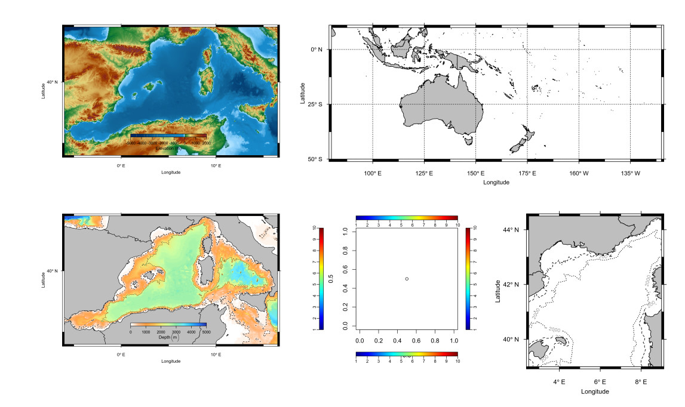

  

<h4 align="center">An R-Package for Mapping and Interactive Visualization of Oceanographic Data</h4>

  <a href="#author">Author</a> •
  <a href="#description">Description</a> •
  <a href="#key-features">Key Features</a> •
  <a href="#tutorial">Tutorial</a> •
  <a href="#credits">Credits</a> •
  <a href="#related">Related</a> •
  <a href="#license">License</a>

## Author

[Dr. Robert Bauer | Fishery Biologist & Data Scientist](https://scholar.google.com/citations?hl=en&user=J-0_tdbR2tgC)

## Description

Visualizing data is a crucial step in analyzing and exploring data. During the last
two decades the statistical programming language R has become a major tool for data
analyses and visualization across different fields of science. However, creating figures
ready for scientific publication can be a tricky and time consuming task.
The oceanmap package provides some helpful functions to facilitate and optimize the
visualization of geographic and oceanographic data, such as satellite and bathymetric
data sets.

## Key Features

* *plotmap()*, *ggplotmap()* and *ggplotmaply()* to plot (interactive) land masks

* *get.bathy()* to download bathymetric data from the NOAA ETOPO1 database

* *set.colorbar()* to define the colorbar (position, ticks, colormap) in base-plots (like plotmap)

* *v()*, an optimized base-plot tool for creating image or contour plots from different data formats
(matrix, array, raster, netcdf, binary)

* *figure()*, to facilitate resizing and saving of figures in diverse formats (jpeg, png,
eps, pdf and eps)

* *cmap*, a data set with several colormaps for oceanographic data

These functions were written in a way that they do not require a large amount of their
numerous arguments to be specified but still return nice plots that are ready for publication.

## Tutorial

You can find [here](https://doi.org/10.13140/RG.2.2.10079.59041) an extensive free online tutorial that covers the different functionalities of the package. Please note that the current tutorial does not include a description of the new *ggplotmap()* and *ggplotmaply()* functions.

## Credits

This package was developed during my PhD thesis at the [IFREMER](\link{https://wwz.ifremer.fr/) and a Postdoc at [IRD](https://www.ird.fr/), which are both part of the [MARBEC lab](http://www.umr-marbec.fr). A ggplot-version of plotmap has been added since.

## Related libraries

- [RchivalTag](https://github.com/rkbauer/R_Package_RchivalTag) - A R-Package to analyze and vizualize archival tagging data.
- [plotly](https://plotly.com/r/) - An open source library for interactive figures.
- [dygraphs](https://rstudio.github.io/dygraphs/) - A R interface to the interactive dygraphs JavaScript charting library.
- [leaflet](https://rstudio.github.io/leaflet/) - A JavaScript-based map widget that can be rendered on HTML pages generated from R Markdown, Shiny, or other applications.

## You may also like...

- [RchivalTag](https://github.com/rkbauer/R_Package_RchivalTag) - A R-Package to map oceanographic data.
- [marine biologging](https://www.facebook.com/marine.biologging) - An online campaign for electronic tagging studies

## References

- Bauer, R. (2017) oceanmap: Mapping oceanographic data. R-package tutorial v.0.0.4, doi: [10.13140/RG.2.2.10079.59041](https://doi.org/10.13140/RG.2.2.10079.59041)

## Visit my work on
>  [GitHub](https://github.com/rkbauer/) &nbsp;&middot;&nbsp;
>  [Google Scholar](https://scholar.google.com/citations?hl=en&user=J-0_tdbR2tgC) &nbsp;&middot;&nbsp;
>  [ResearchGate](https://www.researchgate.net/profile/Robert-Bauer-13) &nbsp;&middot;&nbsp;

